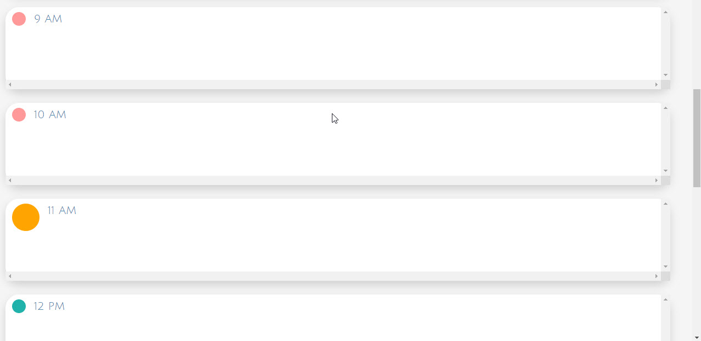
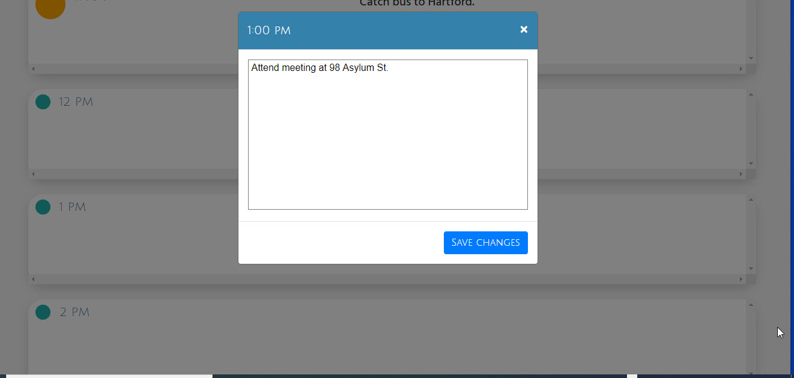
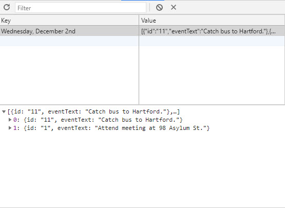

# Current Day Planner: Local Browser Storage
(https://bcefarmer.github.io/day-planner/)

## PURPOSE:
The day-planning app allows a user to create a schedule for the current day, and to have these events save to local storage.

## LANGUAGES USED:
HTML (Bootstrap Framework), CSS, Javascript/jQuery.  This app also uses the Moment.js library for easier date-parsing.

## METHODOLOGIES:
This app's functionality comes from creating and saving events to local storage as JSON objects. Because the number of these events is necessarily limited by the amount of hours in a workday, this programs saves ALL events in an array on each save.

Instead of utilizing a button on the main scheduler layout, the user is guided to a modal window to create and/or edit an event.  This is because there's a HIGH chance a user might forget to press a save button were it included on the main layout.  The modal window guides the user to either save, or cancel the event before progressing to anything else.

## DETAILS

Colored circles are used to designate whether an event is past (red), current (orange and enlarged), or future (green).

 

A modal window allows event creation or editing.  If an event ALREADY EXISTS, it will populate the window.

 

Here, an event is shown saved as JSON in local storage.  The name of the object is the date on
which is was generated.

 
